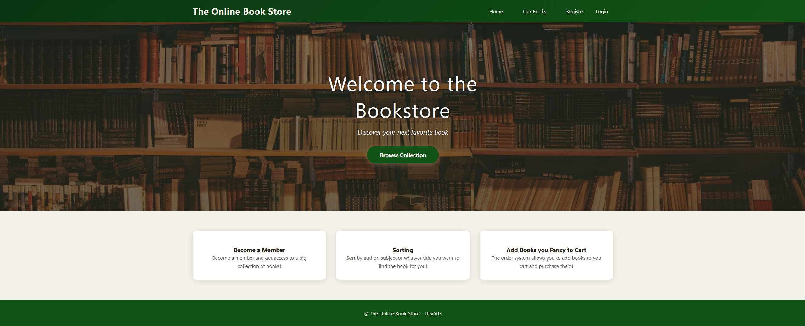
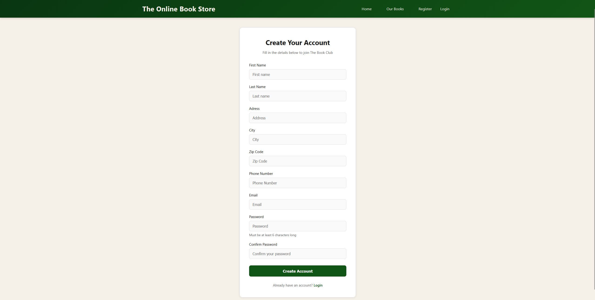
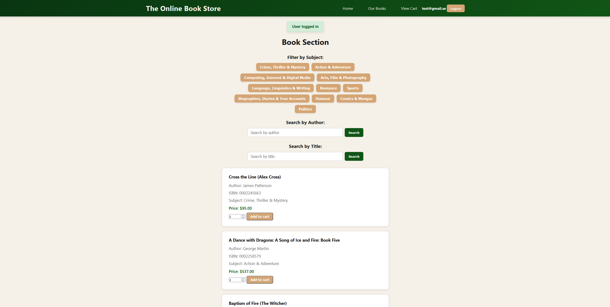
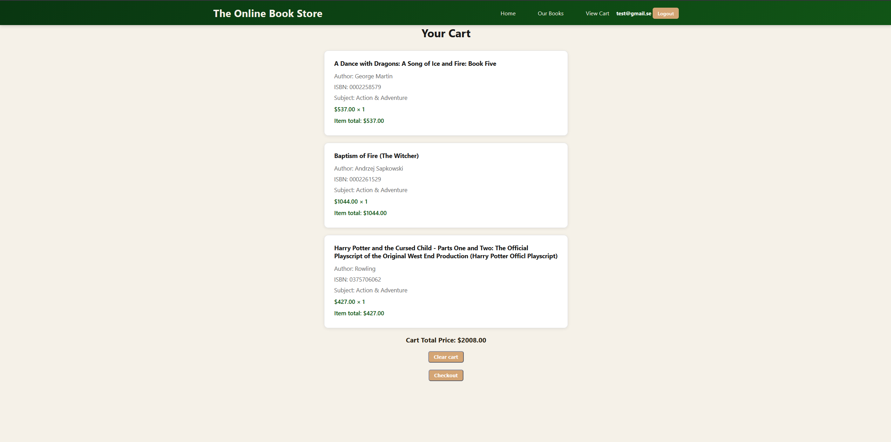

# 1DV503---Assignment-2



# Bookstore Web Application

A simple web application for browsing and purchasing books online, built with Node.js and MySQL.

## Features

- User registration and login
- Browse books by subject
- Search books by author or title
- Add books to shopping cart
- Checkout and order management
- View order invoices






## Running the Application

Start the application:
```bash
npm start
```

The application will run on `http://localhost:3000`

## Usage

1. **Register** - Create a new account with your email and password
2. **Login** - Sign in with your credentials
3. **Browse Books** - Select a subject or search by author/title
4. **Add to Cart** - Select quantity and add books to your cart
5. **View Cart** - Review items in your shopping cart
6. **Checkout** - Complete your order and view the invoice
7. **Logout** - Sign out of your account

## Project Structure

```
project/
├── config/          # Database configuration
├── controllers/     # Request handlers
├── models/          # Database queries
├── routes/          # Route definitions
├── views/           # EJS templates
└── server.js        # Application entry point
```

## Technologies Used

- Node.js
- Express.js
- MySQL (mysql2)
- EJS (templating)
- express-session (session management)
- bcrypt (password encryption)

## Notes

- Email addresses must be unique
- Passwords are encrypted before storing
- Order delivery date is automatically set to 7 days from order date
- Cart is cleared after checkout


